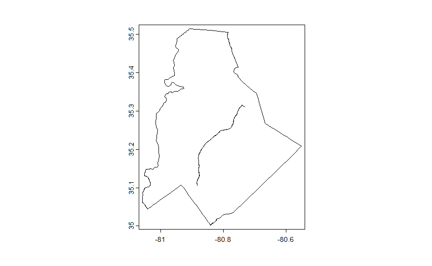

# Team Greenlight’s FIRE Summit Presentation
Nayab Safdar, Okan Ulug-Berter, Rygel Yance, Kenny Zhu

## Research Question

How did the opening of the LYNX Blue Line Light Rail in Charlotte, NC
impact the level of pm 2.5 air pollution in a 10km radius around it?

## Data Wrangling

**Outcome variable**

Our outcome variable was the level of PM2.5 air pollution in a 10km
region surrounding the center of the LYNX Blue Line. The data for this
was gathered and wrangled by our stream’s PRMs.

**Treatment variable**

The treatment variable is whether or not the light rail was opened,
which is just a binary open or not open. The LYNX Blue Line opened in
December of 2007 and has been in operation since. For the wrangling
methodology, this variable was added as an additional column in our
final dataset where 0 would represent the line being closed and 1 would
be the line being open.



This is an image of the Lynx Blue line within the border of Charlotte,
NC

**Control variables**

Our control variable is the Normalized Difference Vegetation Index in
Charlotte in a 10km radius around the center of the light rail. This
data was sourced from NASA EarthData. For data wrangling, the data we
gathered had to be extracted and organized by both the month that each
of the 46 layers had been taken in (see previous code), then limit the
data to only include the 10km region around the LYNX Blue Line. This was
repeated for each of the years between 2000 and 2015. The NDVI data was
then averaged out for each month and combined with the pollution data to
provide a control variable. Example code for extracting the NDVI data
for the year 2000 is show below:

``` r
#Sample loop of extracting the NDVI data for the year 2000

library("tidyverse")
library("terra")
library("simplermarkdown")

transit <- vect("G:/Shared drives/2023 FIRE-SA/FALL OUTPUT/Team Greenlight/LYNX_Blue_Line_Route/LYNX_Blue_Line_Route.shp")
plot(transit)

#connect all lines together
lr<-aggregate(transit, dissolve=TRUE)

#change projection system with latitude and longitude units
lr_project<-project(lr, "+proj=longlat +ellps=WGS84 +datum=WGS84 +no_defs ")

#find centroid
lrc<-centroids(lr_project, inside=FALSE)

#create a buffer with 10 km radius
pts_buffer<-buffer(lrc, width = 10000)

#make a map
plot(pts_buffer)
lines(lr_project, col="red")
points(lrc, col="blue")

r<-rast("G:/Shared drives/2023 FIRE-SA/FALL OUTPUT/Team Greenlight/NASAMODIS Data/2000.nc4")

#Check how many values are in the raster (This is the same across all years)
names(r)

install.packages("ncdf4")
library(ncdf4)
nc<-nc_open("G:/Shared drives/2023 FIRE-SA/FALL OUTPUT/Team Greenlight/NASAMODIS Data/2000.nc4")

library("lubridate")
time<-as.Date(nc$dim$time$vals, origin='2000-01-01')
month<-month(time)

crs(r)
circle_project<-project(pts_buffer, 
                        crs(r))

vars<-names(r)
output<-c()

#extracting the first layer of the raster 46 layers in total
for (i in 1:46) {
  
  #pull out one layer of the raster
  rl<-r[[i]]
  
  dfr1<-terra::extract(rl, circle_project)
  
  ndvi1<-mean(dfr1[,2])
  
  output<-rbind(output, ndvi1)
}
d<-cbind(output,month)
write.csv(d, "G:/Shared drives/2023 FIRE-SA/FALL OUTPUT/Team Greenlight/OUTPUT/2000_PollutionData.csv")
```


This is a map of the LYNX Blue Line and the 10km circle region that we
are interested in.


This is a plot of the NDVI Index on January 1st, 2000. NDVI, or
Normalized Difference Vegetation Index, is a metric used to measure the
health and density of plant life and other greenery, where the higher
the number is, the better the vegetation.

## Preliminary Results

Below is some code to generate some preliminary results for the NDVI
data alongside the PM2.5 Pollution data.

``` r
library("tidyverse")
```

    ── Attaching core tidyverse packages ──────────────────────── tidyverse 2.0.0 ──
    ✔ dplyr     1.1.3     ✔ readr     2.1.4
    ✔ forcats   1.0.0     ✔ stringr   1.5.0
    ✔ ggplot2   3.4.4     ✔ tibble    3.2.1
    ✔ lubridate 1.9.3     ✔ tidyr     1.3.0
    ✔ purrr     1.0.2     
    ── Conflicts ────────────────────────────────────────── tidyverse_conflicts() ──
    ✖ dplyr::filter() masks stats::filter()
    ✖ dplyr::lag()    masks stats::lag()
    ℹ Use the conflicted package (<http://conflicted.r-lib.org/>) to force all conflicts to become errors

``` r
Full_data = read_csv('Combined_Data.csv')
```

    Rows: 192 Columns: 5
    ── Column specification ────────────────────────────────────────────────────────
    Delimiter: ","
    dbl (5): month, year, ndvi, avg_pm25, lr_open

    ℹ Use `spec()` to retrieve the full column specification for this data.
    ℹ Specify the column types or set `show_col_types = FALSE` to quiet this message.

``` r
Full_data_avg<-Full_data %>%
  mutate(date=paste0(as.character(year), "-", as.character(month), "-01")) %>%
  mutate(date=as.Date(date))

ggplot(data = Full_data_avg, aes(x = date, y = ndvi, color = ndvi)) + geom_point() +  ggtitle("NDVI Index over time") + xlab("Date") + ylab("NDVI Index")+
  geom_smooth()+geom_vline(xintercept =as.Date("2007-12-01"))
```

    `geom_smooth()` using method = 'loess' and formula = 'y ~ x'

    Warning: The following aesthetics were dropped during statistical transformation: colour
    ℹ This can happen when ggplot fails to infer the correct grouping structure in
      the data.
    ℹ Did you forget to specify a `group` aesthetic or to convert a numerical
      variable into a factor?


``` r
ggplot(data = Full_data_avg, aes(x = date, y = avg_pm25, color = avg_pm25)) + geom_point() +  ggtitle("PM2.5 Air Pollution (PPM) over time") + xlab("Date") + ylab("PM2.5 (Parts per Million)") + geom_smooth() + geom_vline(xintercept =as.Date("2007-12-01"))
```

    `geom_smooth()` using method = 'loess' and formula = 'y ~ x'

    Warning: The following aesthetics were dropped during statistical transformation: colour
    ℹ This can happen when ggplot fails to infer the correct grouping structure in
      the data.
    ℹ Did you forget to specify a `group` aesthetic or to convert a numerical
      variable into a factor?


The vertical line in each graph represents the date that the LYNX Blue
Line opened, December of 2007. As seen in the NDVI graph, the NDVI was
seemingly unaffected by the opening of the lightrail. However, with the
pollution data, it shows a downwards trend in PM2.5 pollution, and since
the NDVI index shows little change over time, this may indicate that the
lightrail opening had some positive impact on air pollution. However,
this downward trend was also observed before the opening, so it’s
probably not the only factor.

## Preliminary Regression Results

Below is code for some preliminary regression analysis using the cities
of Asheville, Cincinnati, Columbia, and Greensboro as control cities, as
they had similar trends of PM2.5 air pollution as Charlotte prior to the
opening of the Lynx Blue Line. This final dataframe was created in a
similar way to the original for Charlotte, gathering the PM2.5 data over
the same intervals and adding other data such as weather information and
creating a categorical variable to represent each city. All of this data
was collected and put together by our stream’s PRMs to create the final
dataframe we used.

``` r
# Regression Analysis
Controls_data<-read.csv("charlotte_controls.csv")

Controls_data2<-Controls_data %>%
  mutate(Charlotte=ifelse(Name == "Charlotte", 1, 0)) %>%
  mutate(Open=ifelse(year>=2008,1,0))

summary(c1<-lm(pm25 ~ Charlotte + Open + Charlotte:Open, data = Controls_data2))
```


    Call:
    lm(formula = pm25 ~ Charlotte + Open + Charlotte:Open, data = Controls_data2)

    Residuals:
       Min     1Q Median     3Q    Max 
    -7.569 -2.021 -0.480  1.737 10.870 

    Coefficients:
                   Estimate Std. Error t value Pr(>|t|)    
    (Intercept)     14.3016     0.1523  93.896   <2e-16 ***
    Charlotte        0.4119     0.3406   1.209    0.227    
    Open            -4.3208     0.2093 -20.641   <2e-16 ***
    Charlotte:Open  -0.3431     0.4681  -0.733    0.464    
    ---
    Signif. codes:  0 '***' 0.001 '**' 0.01 '*' 0.05 '.' 0.1 ' ' 1

    Residual standard error: 2.985 on 1016 degrees of freedom
    Multiple R-squared:  0.3517,    Adjusted R-squared:  0.3498 
    F-statistic: 183.7 on 3 and 1016 DF,  p-value: < 2.2e-16

``` r
# 2nd Regression with city controls, weather controls, and nonlinear weather controls
install.packages("lfe")
```

    Installing package into '/cloud/lib/x86_64-pc-linux-gnu-library/4.3'
    (as 'lib' is unspecified)

``` r
library("lfe")
```

    Loading required package: Matrix


    Attaching package: 'Matrix'

    The following objects are masked from 'package:tidyr':

        expand, pack, unpack

``` r
Controls_data3<- Controls_data2 %>%
  mutate(Weather = AWND*PRCP*TAVG)

CategoricalModel<- felm(pm25 ~ AWND + TAVG + PRCP + Charlotte + Open + Charlotte:Open + city_num + Weather, data = Controls_data3)

summary(CategoricalModel)
```


    Call:
       felm(formula = pm25 ~ AWND + TAVG + PRCP + Charlotte + Open +      Charlotte:Open + city_num + Weather, data = Controls_data3) 

    Residuals:
        Min      1Q  Median      3Q     Max 
    -6.9623 -1.6496 -0.2551  1.5522  9.2238 

    Coefficients:
                     Estimate Std. Error t value Pr(>|t|)    
    (Intercept)     1.618e+01  5.650e-01  28.632  < 2e-16 ***
    AWND           -4.713e-01  1.137e-01  -4.144  3.7e-05 ***
    TAVG            1.949e-01  1.414e-02  13.777  < 2e-16 ***
    PRCP           -5.114e-03  2.583e-03  -1.980   0.0480 *  
    Charlotte       3.528e+00  3.921e-01   8.996  < 2e-16 ***
    Open           -4.251e+00  1.727e-01 -24.613  < 2e-16 ***
    city_num       -1.220e+00  9.935e-02 -12.283  < 2e-16 ***
    Weather        -1.007e-04  5.409e-05  -1.862   0.0629 .  
    Charlotte:Open -3.051e-01  3.846e-01  -0.793   0.4278    
    ---
    Signif. codes:  0 '***' 0.001 '**' 0.01 '*' 0.05 '.' 0.1 ' ' 1

    Residual standard error: 2.451 on 1011 degrees of freedom
    Multiple R-squared(full model): 0.5648   Adjusted R-squared: 0.5614 
    Multiple R-squared(proj model): 0.5648   Adjusted R-squared: 0.5614 
    F-statistic(full model):  164 on 8 and 1011 DF, p-value: < 2.2e-16 
    F-statistic(proj model):   164 on 8 and 1011 DF, p-value: < 2.2e-16 

The results from our preliminary dataframe are further supported through
the regression results. The first regression, which only uses the light
rail open and Charlotte variables, only gives a coefficient of -0.34 for
the Charlotte:Open variable, which is what we’re interested in. This is
not significantly different from 0, so this regression shows that
there’s very little or no correlation between the light rail opening and
the level of PM2.5 pollution. Adding in our control cities, weather
controls, and non-linear weather controls to our regression, the
coefficient for Charlotte:Open goes down to -0.31, which is even lower
and again seems to support the idea that the opening of the Lynx Blue
Line has little to no correlation with the level of PM2.5 air pollution
in the immediate area. From the first graph through, it’s clear that
there’s been a downward trend in PM2.5 air pollution over the years, so
there’s likely other factors that could be causing this.
