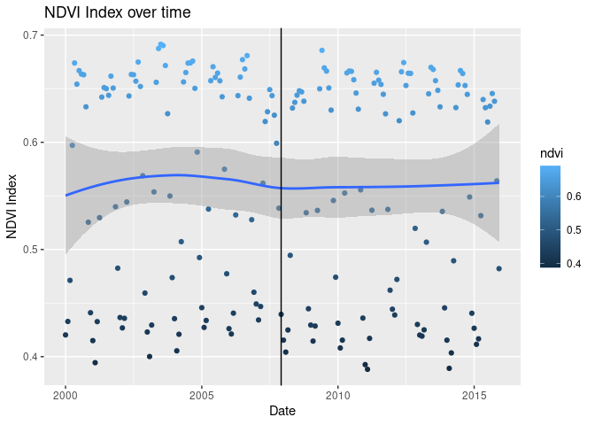
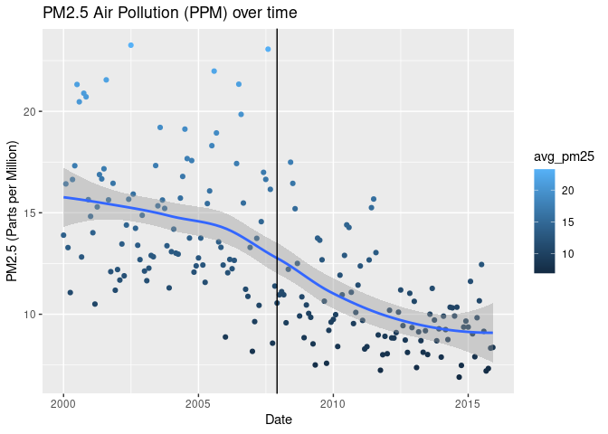

# Team Greenlight’s FIRE Summit Presentation
Nayab Safdar, Okan Ulug-Berter, Rygel Yance, Kenny Zhu

## Research Question

How did the opening of the LYNX Blue Line Light Rail in Charlotte, NC
impact the level of pm 2.5 air pollution in a 10km radius around it?

## Data Wrangling

**Outcome variable**

Our outcome variable was the level of PM2.5 air pollution in a 10km
region surrounding the center of the LYNX Blue Line. The data for this
was gathered and wrangled by our stream’s PRMs.

**Treatment variable**

The treatment variable is whether or not the light rail was opened,
which is just a binary open or not open. The LYNX Blue Line opened in
December of 2007 and has been in operation since. For the wrangling
methodology, this variable was added as an additional column in our
final dataset where 0 would represent the line being closed and 1 would
be the line being open.


**Control variables**

Our control variable is the Normalized Difference Vegetation Index in
Charlotte in a 10km radius around the center of the light rail. This
data was sourced from NASA EarthData. For data wrangling, the data we
gathered had to be extracted and organized by both the month that each
of the 46 layers had been taken in (see previous code), then limit the
data to only include the 10km region around the LYNX Blue Line. This was
repeated for each of the years between 2000 and 2015. The NDVI data was
then averaged out for each month and combined with the pollution data to
provide a control variable. Example code for extracting the NDVI data
for the year 2000 is show below:

``` r
#Sample loop of extracting the NDVI data for the year 2000

library("tidyverse")
library("terra")
library("simplermarkdown")

transit <- vect("G:/Shared drives/2023 FIRE-SA/FALL OUTPUT/Team Greenlight/LYNX_Blue_Line_Route/LYNX_Blue_Line_Route.shp")
plot(transit)

#connect all lines together
lr<-aggregate(transit, dissolve=TRUE)

#change projection system with latitude and longitude units
lr_project<-project(lr, "+proj=longlat +ellps=WGS84 +datum=WGS84 +no_defs ")

#find centroid
lrc<-centroids(lr_project, inside=FALSE)

#create a buffer with 10 km radius
pts_buffer<-buffer(lrc, width = 10000)

#make a map
plot(pts_buffer)
lines(lr_project, col="red")
points(lrc, col="blue")

r<-rast("G:/Shared drives/2023 FIRE-SA/FALL OUTPUT/Team Greenlight/NASAMODIS Data/2000.nc4")

#Check how many values are in the raster (This is the same across all years)
names(r)

install.packages("ncdf4")
library(ncdf4)
nc<-nc_open("G:/Shared drives/2023 FIRE-SA/FALL OUTPUT/Team Greenlight/NASAMODIS Data/2000.nc4")

library("lubridate")
time<-as.Date(nc$dim$time$vals, origin='2000-01-01')
month<-month(time)

crs(r)
circle_project<-project(pts_buffer, 
                        crs(r))

vars<-names(r)
output<-c()

#extracting the first layer of the raster 46 layers in total
for (i in 1:46) {
  
  #pull out one layer of the raster
  rl<-r[[i]]
  
  dfr1<-terra::extract(rl, circle_project)
  
  ndvi1<-mean(dfr1[,2])
  
  output<-rbind(output, ndvi1)
}
d<-cbind(output,month)
write.csv(d, "G:/Shared drives/2023 FIRE-SA/FALL OUTPUT/Team Greenlight/OUTPUT/2000_PollutionData.csv")
```


## Preliminary Results

Below is some code to generate some preliminary results for the NDVI
data alongside the PM2.5 Pollution data.

``` r
library("tidyverse")
```

    ── Attaching core tidyverse packages ──────────────────────── tidyverse 2.0.0 ──
    ✔ dplyr     1.1.3     ✔ readr     2.1.4
    ✔ forcats   1.0.0     ✔ stringr   1.5.0
    ✔ ggplot2   3.4.4     ✔ tibble    3.2.1
    ✔ lubridate 1.9.3     ✔ tidyr     1.3.0
    ✔ purrr     1.0.2     
    ── Conflicts ────────────────────────────────────────── tidyverse_conflicts() ──
    ✖ dplyr::filter() masks stats::filter()
    ✖ dplyr::lag()    masks stats::lag()
    ℹ Use the conflicted package (<http://conflicted.r-lib.org/>) to force all conflicts to become errors

``` r
Full_data = read_csv('Combined_Data.csv')
```

    Rows: 192 Columns: 5
    ── Column specification ────────────────────────────────────────────────────────
    Delimiter: ","
    dbl (5): month, year, ndvi, avg_pm25, lr_open

    ℹ Use `spec()` to retrieve the full column specification for this data.
    ℹ Specify the column types or set `show_col_types = FALSE` to quiet this message.

``` r
Full_data_avg<-Full_data %>%
  mutate(date=paste0(as.character(year), "-", as.character(month), "-01")) %>%
  mutate(date=as.Date(date))

ggplot(data = Full_data_avg, aes(x = date, y = ndvi, color = ndvi)) + geom_point() +  ggtitle("NDVI Index over time") + xlab("Date") + ylab("NDVI Index")+
  geom_smooth()+geom_vline(xintercept =as.Date("2007-12-01"))
```

    `geom_smooth()` using method = 'loess' and formula = 'y ~ x'

    Warning: The following aesthetics were dropped during statistical transformation: colour
    ℹ This can happen when ggplot fails to infer the correct grouping structure in
      the data.
    ℹ Did you forget to specify a `group` aesthetic or to convert a numerical
      variable into a factor?



``` r
ggplot(data = Full_data_avg, aes(x = date, y = avg_pm25, color = avg_pm25)) + geom_point() +  ggtitle("PM2.5 Air Pollution (PPM) over time") + xlab("Date") + ylab("PM2.5 (Parts per Million)") + geom_smooth() + geom_vline(xintercept =as.Date("2007-12-01"))
```

    `geom_smooth()` using method = 'loess' and formula = 'y ~ x'

    Warning: The following aesthetics were dropped during statistical transformation: colour
    ℹ This can happen when ggplot fails to infer the correct grouping structure in
      the data.
    ℹ Did you forget to specify a `group` aesthetic or to convert a numerical
      variable into a factor?



The vertical line in each graph represents the date that the LYNX Blue
Line opened, December of 2007. As seen in the NDVI graph, the NDVI was
seemingly unaffected by the opening of the lightrail. However, with the
pollution data, it shows a downwards trend in PM2.5 pollution, and since
the NDVI index shows little change over time, this may indicate that the
lightrail opening had some positive impact on air pollution. However,
this downward trend was also observed before the opening, so it’s
probably not the only factor.
